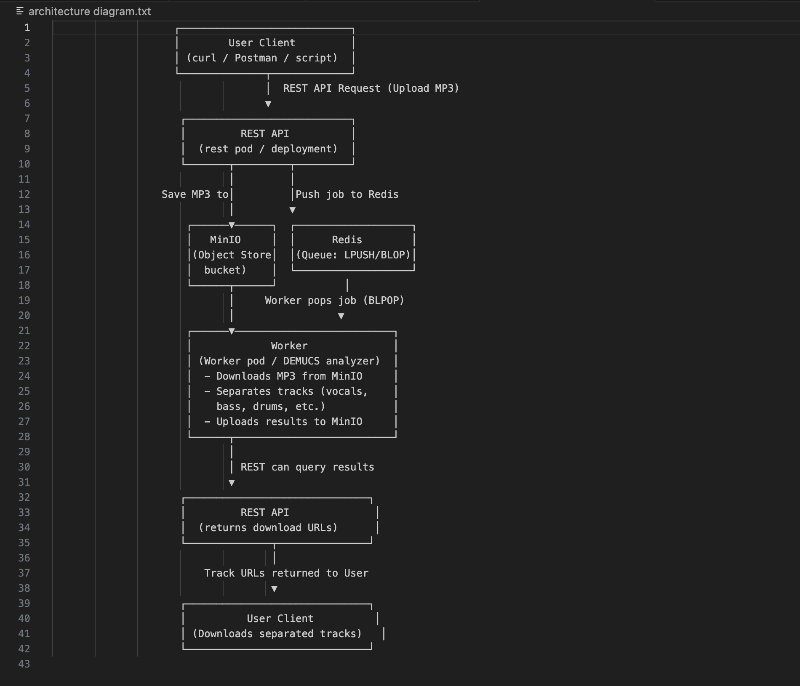
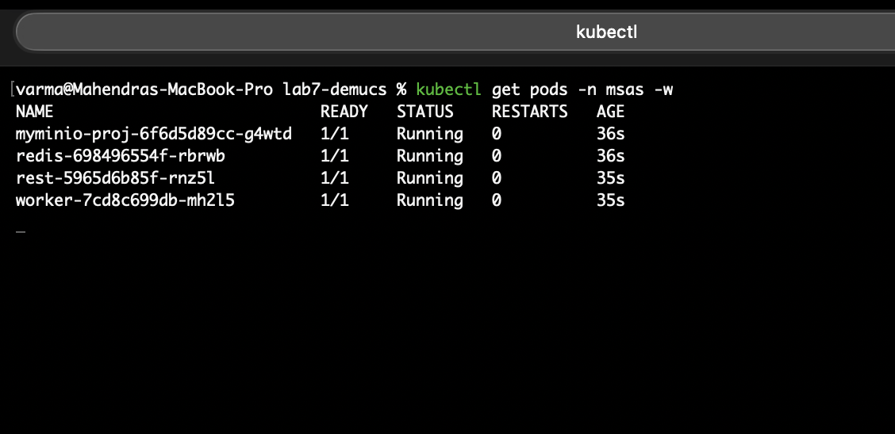
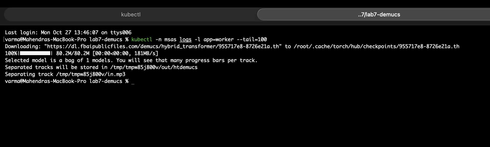
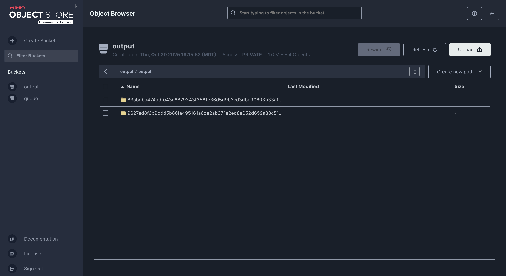
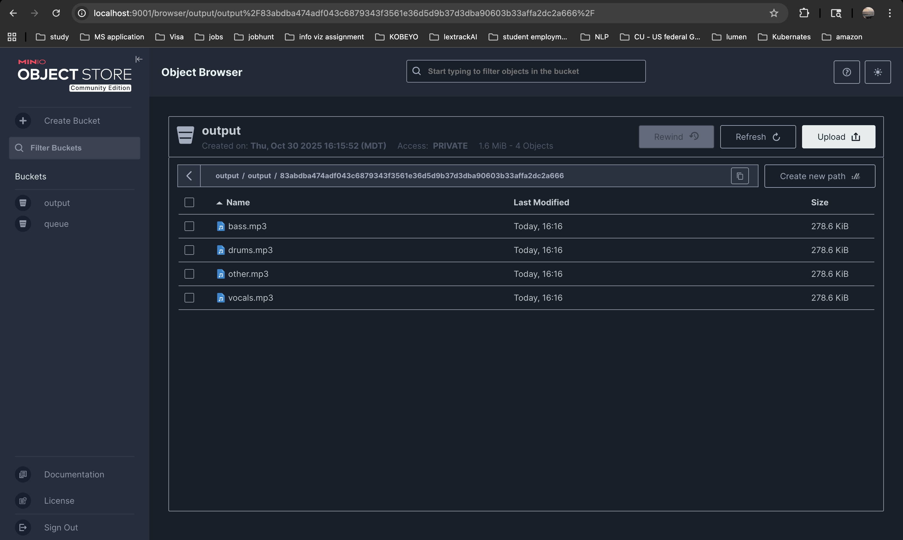

# 🎵 Lab 7 – Music Separation as a Service (MSaaS)

**Course:** CSCI 4253/5253 – Datacenter-Scale Computing  
**Student:** Mahendra Varma Vaddi  
**University:** University of Colorado Boulder  
**Instructor:** Dr. Goodman

---

## 📘 Overview

This lab implements a **microservice-based music-separation platform** using **Kubernetes**.  
The system provides an HTTP REST API to upload MP3 files, which are then separated into stems (vocals, drums, bass, other) using Facebook’s **Demucs** model.

Each component runs in a separate container managed by Kubernetes. Communication between services is handled via **Redis queues**, and separated outputs are stored in **MinIO object storage**.

---

## 🧩 Architecture Overview

### Components

| Component          | Function                                                                     | Technology                   |
| ------------------ | ---------------------------------------------------------------------------- | ---------------------------- |
| **REST Service**   | Accepts API requests (`/apiv1/separate`) and enqueues jobs to Redis          | Flask (Python)               |
| **Redis Server**   | Message queue between REST and Worker                                        | Redis                        |
| **Worker Service** | Pulls jobs from Redis, downloads MP3s, runs Demucs, uploads outputs to MinIO | Python + TorchAudio + Demucs |
| **MinIO Server**   | Stores input/output objects (“queue” and “output” buckets)                   | MinIO (S3-compatible)        |

### Visual Architecture Diagram

## 

Create Cluster

```
gcloud container clusters create msas-cluster \
  --zone=us-central1-a \
  --num-nodes=2 \
  --machine-type=e2-standard-4

```

Authenticate

```
gcloud container clusters get-credentials msas-cluster --zone=us-central1-a

Create Namespace and Secrets
kubectl create namespace msas

kubectl -n msas create secret generic minio-credentials \
 --from-literal=MINIO_ACCESS_KEY=minio \
 --from-literal=MINIO_SECRET_KEY=minio123
```

🐳 Build and Push Docker Images

```
PROJECT=demucs-lab
docker build -t us-central1-docker.pkg.dev/$PROJECT/msas/msas-rest:v1 ./rest
docker build -t us-central1-docker.pkg.dev/$PROJECT/msas/msas-worker:v1 ./worker

gcloud auth configure-docker us-central1-docker.pkg.dev
docker push us-central1-docker.pkg.dev/$PROJECT/msas/msas-rest:v1
docker push us-central1-docker.pkg.dev/$PROJECT/msas/msas-worker:v1
```

🚀 Deploy on Kubernetes

```
kubectl -n msas apply -f redis/redis-deployment.yaml
kubectl -n msas apply -f minio/minio-deployment.yaml
kubectl -n msas apply -f rest/rest-deployment.yaml
kubectl -n msas apply -f worker/worker-deployment.yaml
```

Verify:

```
kubectl -n msas get pods,svc
```



🔌 Port Forward Services (for Testing)

```
kubectl -n msas port-forward svc/rest-service 5000:5000 &
kubectl -n msas port-forward svc/myminio-proj 9001:9000 &
```

🧪 Run Client Tests

Short Sample (Quick Validation)

```
python short-sample-request.py
```

Worker logs


Output- Generated



This lab demonstrated the power of Kubernetes microservices for scalable machine-learning workflows.
By decoupling the frontend (REST), backend (Worker), and storage (MinIO), we achieved fault tolerance and scalability similar to production cloud systems.
